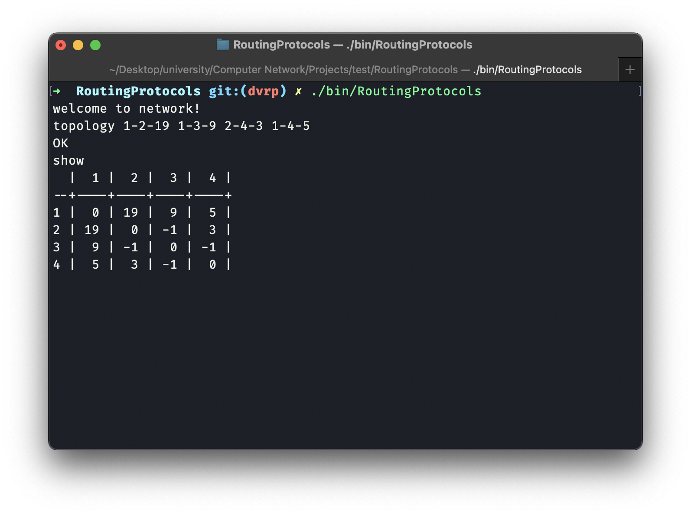
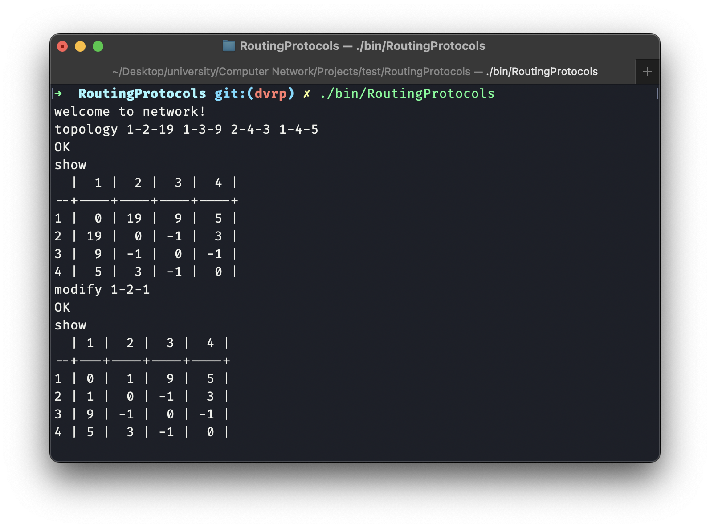
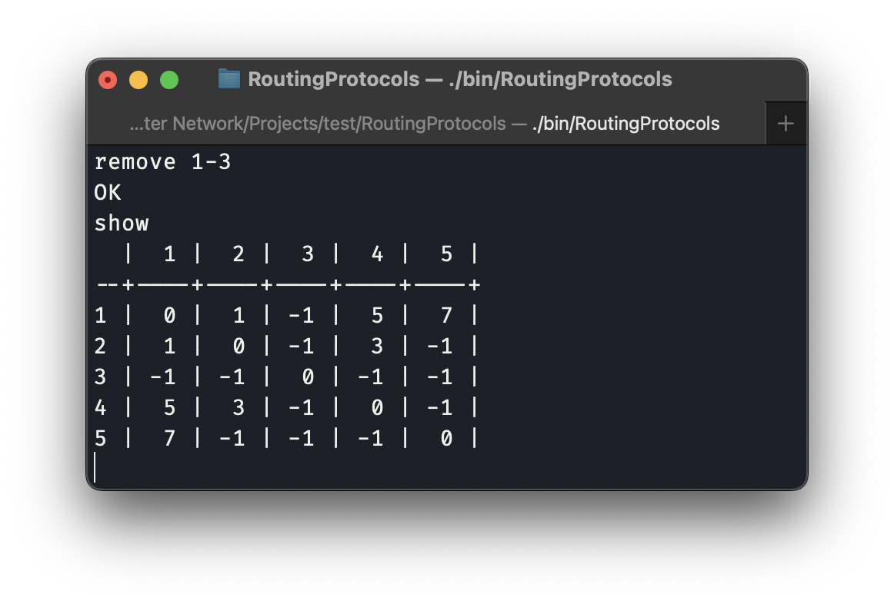
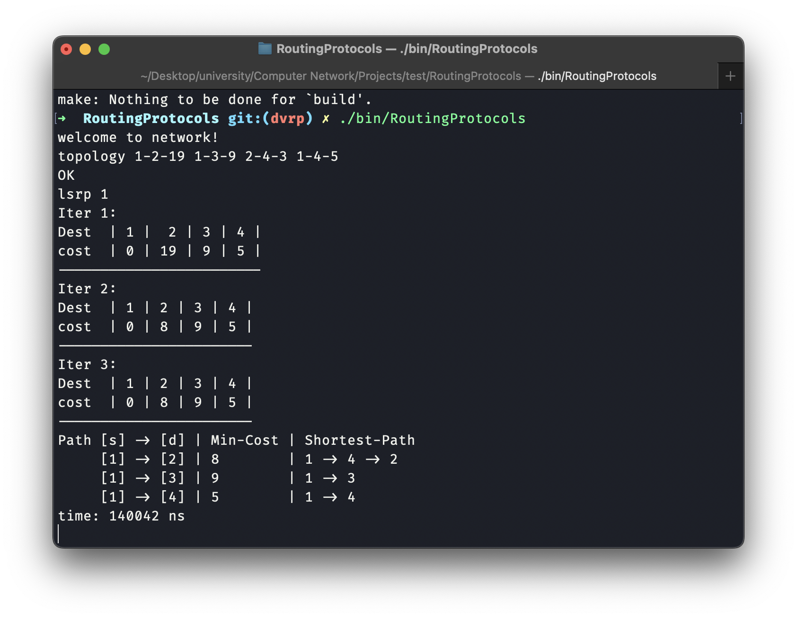
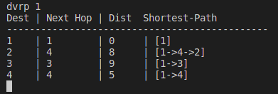

# RoutingProtocols
Routing Protocols ,3rd CA of The Computer Networks course @ University of Tehran, spring 2023

In this assignment, we would implement `Border Gateway(BGP)`, `Distance Vector(DVRP)` and `Link State(LSRP)` algorithms and compare their results and converging time.

# How it works
## Project structure
```
RoutingProtocols
|
|
+---+codes (source codes are place here)
|   |
|   |
|   +bgp.cpp
|   +dvrp.cpp
|   +lsrp.cpp
|   +network.cpp
|   +main.cpp
|
+---+test  (tests are here)
|   |
|   |
|   +test<i>.input
|   +test<i>.output
|
+Makefile
|
+README.md  (also our report)
```

## Build project
If you just want to build project, you can run:
```bash
make build
```
Then, binary file would be available at `bin` directory.

If you run:
```bash
make
```
it would build project and also run protocol tests for program.

If you just want to run tests:
```bash
make test
```

## Tests
Here are which functionality would test by each of our test:
- test1: It is for testing networks and following commands:
  - topology: to define the network's topology
  - modify: for adding new connection or update a connection's cost
  - remove: to remove a connection
  - show: to show the network topology (as graph table view)
- test2: to test LSRP
- test3: to test DVRP
- test4: to test BGP

# Network
Here are a sample result for different network modifying actions and their result:
- Topology ($1 \leftrightarrow 2=19$, $1 \leftrightarrow 3=9$ $2 \leftrightarrow 4=3$ $1 \leftrightarrow 4=5$)

- Modify (edit cost)

- Modify (add new link)

- Remove


# Protocols
In this section, 
## Link State Routing Protocol (LSRP)
As we know in this alghrithm each node independently runs an algorithm over the map to determine 
the shortest path from itself to every other node in the network; generally some variant of Dijkstra's algorithm 
is used. At line below
```c++
auto topology = network->get_topology();
```
We give topology or map of network to the node and we start from source node and add it with cost to reach. 
After that at each round, we pick least cost node which is unmarked and then we mark it and check it's neighbour 
for finding less cost path to ramainder nodes.
```c++
for (int j = 0; j < mark_node->second.size(); j++) {
            if (nodes[min_index].cost + mark_node->second[j].cost >= nodes[mark_node->second[j].dst - 1].cost)
                continue;
            nodes[mark_node->second[j].dst - 1].cost = nodes[min_index].cost + mark_node->second[j].cost;
            vector<int> parent_path = paths[min_index];
            parent_path.push_back(mark_node->second[j].dst);
            paths[mark_node->second[j].dst - 1] = parent_path;
}
```
After that we print the result of algorithm.
Here is example for `topology 1-2-19 1-3-9 2-4-3 1-4-5` for node source = 1:



## DVRP
As we know this alghrithm use the Bellman Ford algorithm. In these protocols, each router does not have network topology. 
It advertises its routing table calculated to other routers and receives similar advertisements from other routers 
unless changes are done in the local network or by neighbours (routers). 
Using these routing table each router populates its routing table. 
In the next advertisement cycle, a router advertises updated information from its routing table. 
This process continues until the routing tables of each router converge to stable values.

At line below

```c++
map<int, vector<Edge>, less<int>> tables;
```
we store nodes routing tables of each node and each node just know about it's neighbour and update its' routing table by it's neighbour routing tables to find shorter path. and all of the nodes do this until their routing tables converge to stable values and don't be updated.

Here is example for `topology 1-2-19 1-3-9 2-4-3 1-4-5` for node source = 1:

