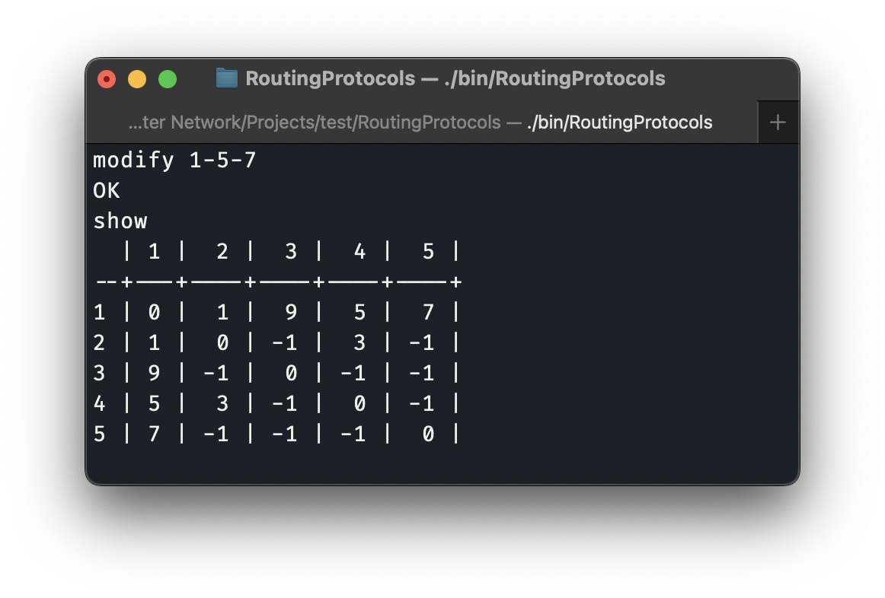
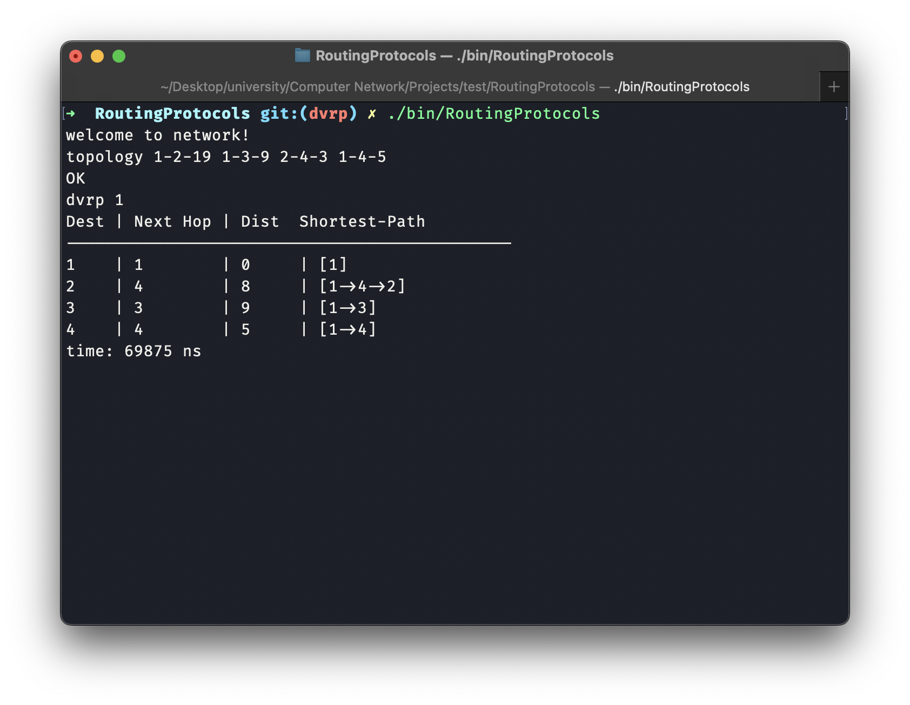

# RoutingProtocols
Routing Protocols ,3rd CA of The Computer Networks course @ University of Tehran, spring 2023

In this assignment, we would implement `Border Gateway(BGP)`, `Distance Vector(DVRP)` and `Link State(LSRP)` algorithms and compare their results and converging time.

# How it works
## Project structure
```
RoutingProtocols
|
|
+---+codes (source codes are place here)
|   |
|   |
|   +bgp.cpp
|   +dvrp.cpp
|   +lsrp.cpp
|   +network.cpp
|   +main.cpp
|
+---+test  (tests are here)
|   |
|   |
|   +test<i>.input
|   +test<i>.output
|
+---+evaluation
|   |
|   +eval
|   +result
|
+Makefile
|
+README.md  (also our report)
```

## Build project
If you just want to build project, you can run:
```bash
make build
```
Then, binary file would be available at `bin` directory.

If you run:
```bash
make
```
it would build project and also run protocol tests for program.

If you just want to run tests:
```bash
make test
```

You can also use below command for evaluation:
```bash
make eval
```

## Tests
Here are which functionality would test by each of our test:
- test1: It is for testing networks and following commands:
  - topology: to define the network's topology
  - modify: for adding new connection or update a connection's cost
  - remove: to remove a connection
  - show: to show the network topology (as graph table view)
- test2: to test LSRP
- test3: to test DVRP
- test4: to test BGP

# Network
Here are a sample result for different network modifying actions and their result:
- Topology ($1 \leftrightarrow 2 \Rightarrow 19$, $1 \leftrightarrow 3 \Rightarrow 9$, $2 \leftrightarrow 4 \Rightarrow 3$, $1 \leftrightarrow 4 \Rightarrow 5$)

- Modify (edit cost)

- Modify (add new link)

- Remove


# Protocols
In this section, 
## Link State Routing Protocol (LSRP)
As we know in this alghrithm each node independently runs an algorithm over the map to determine 
the shortest path from itself to every other node in the network; generally some variant of Dijkstra's algorithm 
is used. At line below
```c++
auto topology = network->get_topology();
```
We give topology or map of network to the node and we start from source node and add it with cost to reach. 
After that at each round, we pick least cost node which is unmarked and then we mark it and check it's neighbour 
for finding less cost path to ramainder nodes.
```c++
for (int j = 0; j < mark_node->second.size(); j++) {
            if (nodes[min_index].cost + mark_node->second[j].cost >= nodes[mark_node->second[j].dst - 1].cost)
                continue;
            nodes[mark_node->second[j].dst - 1].cost = nodes[min_index].cost + mark_node->second[j].cost;
            vector<int> parent_path = paths[min_index];
            parent_path.push_back(mark_node->second[j].dst);
            paths[mark_node->second[j].dst - 1] = parent_path;
}
```
After that we print the result of algorithm.
Here is example for `topology 1-2-19 1-3-9 2-4-3 1-4-5` for node source = 1:


### Time Complexity
The time complexity of the Link State Routing Protocol (LSRP) is $`O(n^3)`$,
where `n` is the number of nodes in the network.
This is because of LSRP has the same time complexity as dijkstra algorithm (which is $`O(n^3)`$)

## Distance Vector Routing Protocol (DVRP)
As we know this alghrithm use the Bellman Ford algorithm. In these protocols, each router does not have network topology. 
It advertises its routing table calculated to other routers and receives similar advertisements from other routers 
unless changes are done in the local network or by neighbours (routers). 
Using these routing table each router populates its routing table. 
In the next advertisement cycle, a router advertises updated information from its routing table. 
This process continues until the routing tables of each router converge to stable values.

At line below

```c++
map<int, vector<Edge>, less<int>> tables;
```
we store nodes routing tables of each node and each node just know about it's neighbour and update its' routing table by it's neighbour routing tables to find shorter path. and all of the nodes do this until their routing tables converge to stable values and don't be updated.

Here is example for `topology 1-2-19 1-3-9 2-4-3 1-4-5` for node source = 1:



### Time Complexity
The time complexity of the Distance Vector Routing Protocol (DVRP) is $`O(n^3)`$, 
where `n` is the number of nodes in the network. 
This is because of DVRP has the same time complexity as bellman-ford algorithm (which is $`O(V.E)`$ and $`E=O(V^2)`$)

## Border Gateway Protocol (BGP)
One moment while I search the internet...

__ff__source[{"title":"Border Gateway Protocol - Wikipedia","url":"https://en.wikipedia.org/wiki/Border_Gateway_Protocol","favicon":"https://www.google.com/s2/favicons?sz=64&domain_url=https://en.wikipedia.org/wiki/Border_Gateway_Protocol"},{"title":"What is BGP and How Does Border Gateway Protocol Work?","url":"https://www.techtarget.com/searchnetworking/definition/BGP-Border-Gateway-Protocol","favicon":"https://www.google.com/s2/favicons?sz=64&domain_url=https://www.techtarget.com/searchnetworking/definition/BGP-Border-Gateway-Protocol"},{"title":"www.cloudflare.com","url":"https://www.cloudflare.com/learning/security/glossary/what-is-bgp/","favicon":"https://www.google.com/s2/favicons?sz=64&domain_url=https://www.cloudflare.com/learning/security/glossary/what-is-bgp/"}]__endsourceIn the Border Gateway Protocol (BGP), routers exchange routing information between autonomous systems (ASes). BGP is a path vector protocol that constructs an autonomous systems' graph based on the information exchanged between BGP routers. It is designed to be highly scalable and is used to maintain routing tables on the Internet.

BGP routers establish connections with their neighbors, called BGP peers, and exchange routing information. Each BGP router maintains a routing table that contains the best routes to reach different destinations. When a router receives an update from a peer, it processes the update and, if necessary, modifies its routing table. The router then propagates the updated information to its other peers.

Here's a high-level overview of how BGP works:

1. BGP routers establish connections with their BGP peers.
2. Each router maintains a routing table containing the best routes to reach different destinations.
3. When a router receives an update from a peer, it processes the update and modifies its routing table if necessary.
4. The router propagates the updated information to its other peers.
5. This process continues until the routing tables of all routers converge to stable values.

BGP is designed to be policy-based, allowing administrators to control the selection of routes based on various criteria, such as the AS path length, the origin of the route, or other attributes. This flexibility enables BGP to support various routing policies and ensures the stability and scalability of the Internet.

### Time Complexity

In the Border Gateway Protocol (BGP), routers exchange routing information between autonomous systems (ASes). 
BGP is a path vector protocol that constructs an autonomous systems' graph based on the information exchanged 
between BGP routers. It is designed to be highly scalable and is used to maintain routing tables on the Internet.

BGP routers establish connections with their neighbors, called BGP peers, and exchange routing information. 
Each BGP router maintains a routing table that contains the best routes to reach different destinations. 
When a router receives an update from a peer, it processes the update and, if necessary, modifies its routing table. 
The router then propagates the updated information to its other peers.

Here's a high-level overview of how BGP works:
- BGP routers establish connections with their BGP peers. 
- Each router maintains a routing table containing the best routes to reach different destinations. 
- When a router receives an update from a peer, it processes the update and modifies its routing table if necessary. 
- The router propagates the updated information to its other peers.
- This process continues until the routing tables of all routers converge to stable values.


One moment while I search the internet...
In the Border Gateway Protocol (BGP), routers exchange routing information between autonomous systems (ASes). BGP is a path vector protocol that constructs an autonomous systems' graph based on the information exchanged between BGP routers. It is designed to be highly scalable and is used to maintain routing tables on the Internet.
BGP routers establish connections with their neighbors, called BGP peers, and exchange routing information. Each BGP router maintains a routing table that contains the best routes to reach different destinations. When a router receives an update from a peer, it processes the update and, if necessary, modifies its routing table. The router then propagates the updated information to its other peers.
Here's a high-level overview of how BGP works:
BGP routers establish connections with their BGP peers.
Each router maintains a routing table containing the best routes to reach different destinations.
When a router receives an update from a peer, it processes the update and modifies its routing table if necessary.
The router propagates the updated information to its other peers.
This process continues until the routing tables of all routers converge to stable values.

BGP is designed to be policy-based, allowing administrators to control the selection of routes 
based on various criteria, such as the AS path length, the origin of the route, or other attributes. 
This flexibility enables BGP to support various routing policies and ensures the stability 
and scalability of the Internet.

### Time Complexity
The time complexity of the Border Gateway Protocol (BGP) is difficult to determine precisely, 
as it depends on various factors such as the number of routers, the number of autonomous systems, 
and the frequency of routing updates. However, BGP is designed to be highly scalable 
and can handle large-scale networks like the Internet. 
The convergence time of BGP can vary depending on the network topology and configuration, 
but it generally `converges faster than other routing protocols like RIP or OSPF`.
